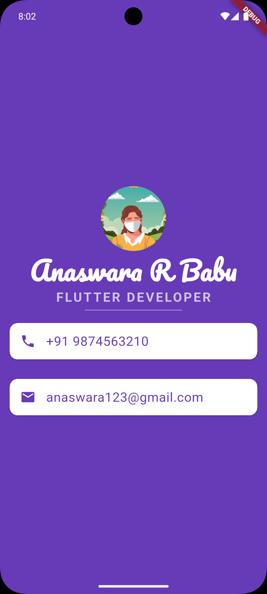

# business_card

A simple Flutter project that helped me understand the **basic concepts of widgets** and how to use them in building a UI.

## 📱 Screenshot

> *(Make sure you add the image `business_card.png` inside a `screenshots` folder in your project directory.)*

## Getting Started

This project is a starting point for learning Flutter.
